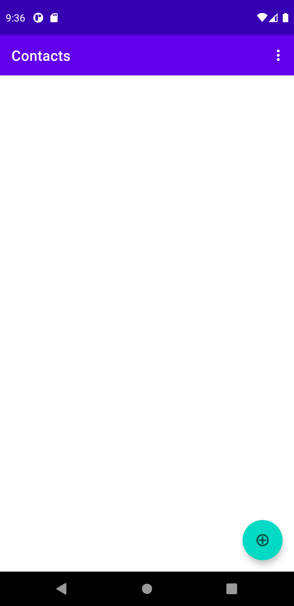
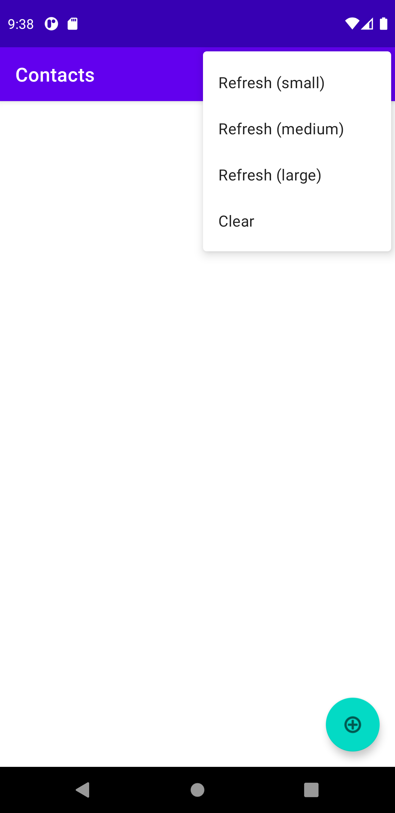
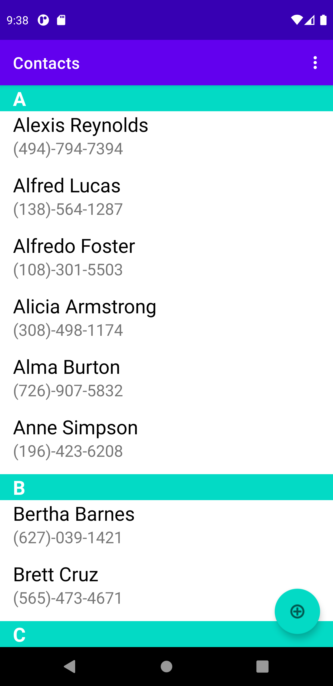
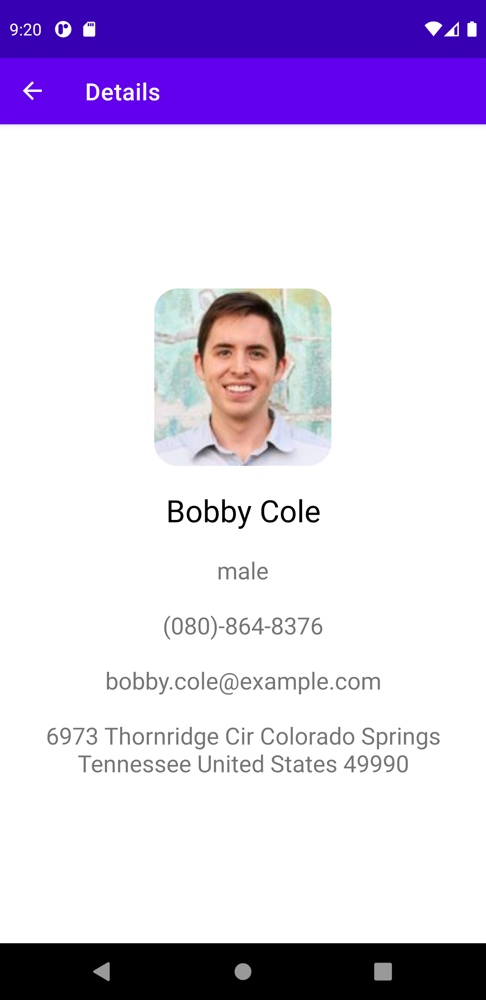
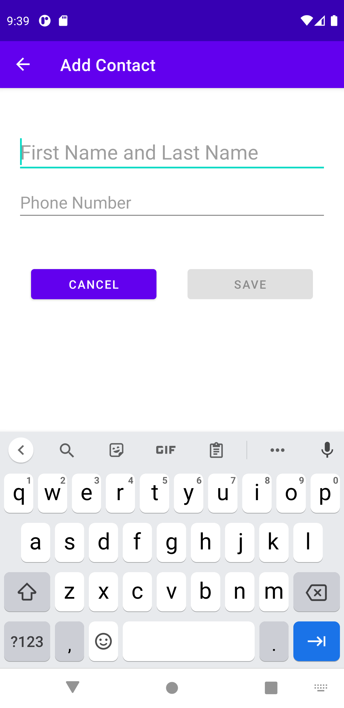

# Android-ContactsApp

## What's Contacts App
An application that fetches random contact data and displays the details. Users can also add new contact data. 

## Screenshot
<p float="left">
  
   
  
  
  
</p>

## Feature
- Fetch contact data from an API.
- Display the contact details.
- Store data into Room database.
- Add new contacts.

## Reference
- [the Random User Generator API](https://randomuser.me/documentation)
- [Retrofit](https://square.github.io/retrofit/): HTTP client
- [Moshi](https://github.com/square/moshi): Convert JSON response to Kotlin Object

## Dependency
````
- Kotlin: 1.5.10
- Room: 2.3.0
- Gradle: 4.2.1
- Retrofit: 2.9.0
- Moshi: 1.12.0
- Glide: 4.8.0
````
